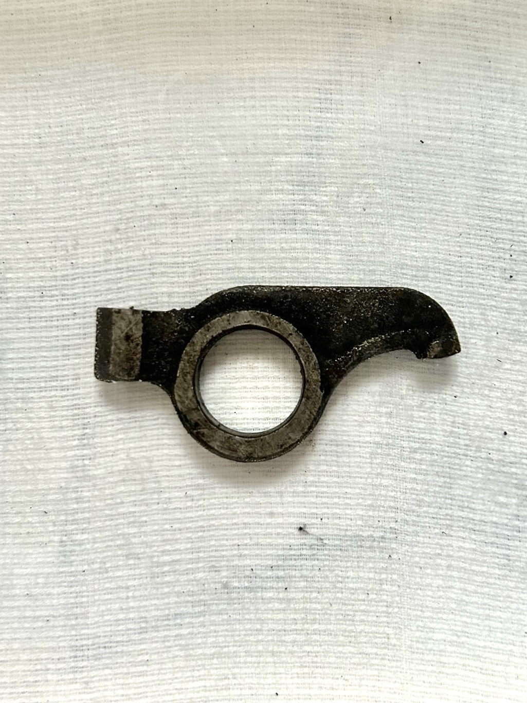
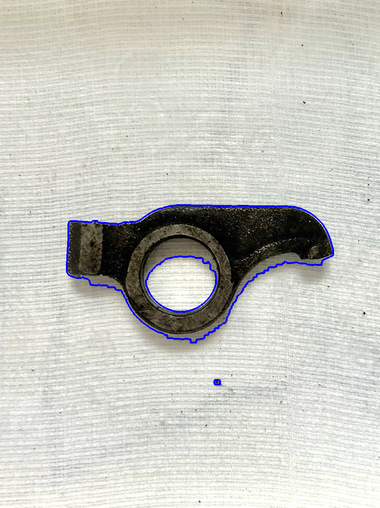

# Машинное зрение
Проект по машинному зрению. Распознавание металических деталей расположенных в воде.
Для наиболее корректного распознавания деталей, необходимо, чтобы детали были металическими, не бликовали, не имели ярко выраженных теней
и находились в воде.

## Установка

- Создайте виртуальное окружение
```bash
python -m venv venv
```
- Активируйте виртуальное окружение
```bash
source venv/bin/activate
```

- Установите зависимости
```bash
pip install -r requirements.txt
```

## Запуск проекта

- Для обработки видеопотока запустите файл `main.py`
```bash
python main.py
```

- Для обработки изображения запустите файл `image.py`
```bash
python image.py
```

## Структура проекта
- `image.py` - файл для обработки изображения, где нужно поместить все фотографии, что нужно обработать в папку `photos_in`.
В случае успешного завершения работы программы обработаные снимки появятся в папке `photos_out`.

```python
if __name__ == "__main__":
    for filename in os.listdir("photos_in"):
        image_path = os.path.join("photos_in", filename)
        detect_contours_in_water(image_path)
```

- `main.py` - файл для обработки видео, где нужно указать источник видеопотока.
В результате успешного запуска программы будут выведены 3 окна:
    - `Detected Counters` - результат работы программы, изображение с контурами деталей
    - `Gray` - кадр после преобразования в черно-белый
    - `Counters` - кадр после преобразования в черно-белый и применения фильтра краев
```python
def main():
    # Инициализация камеры
    cap = cv2.VideoCapture(0) # 0 - камера ноутбука, 1 - внешняя камера

    if not cap.isOpened():
        print("Не удалось открыть камеру")
        return
```

## Пример работы программы

- Исходное изображение

- Результат работы программы
